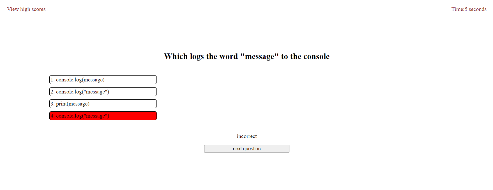
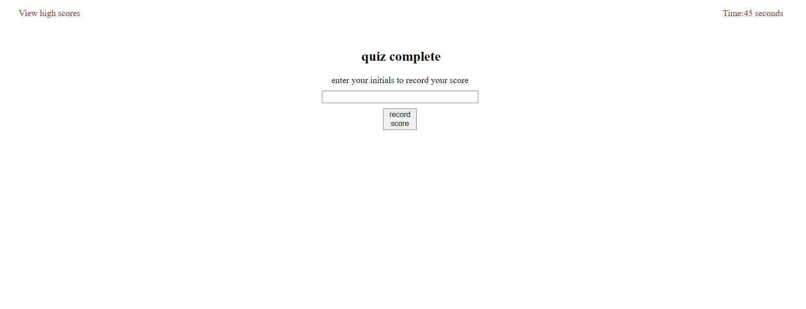
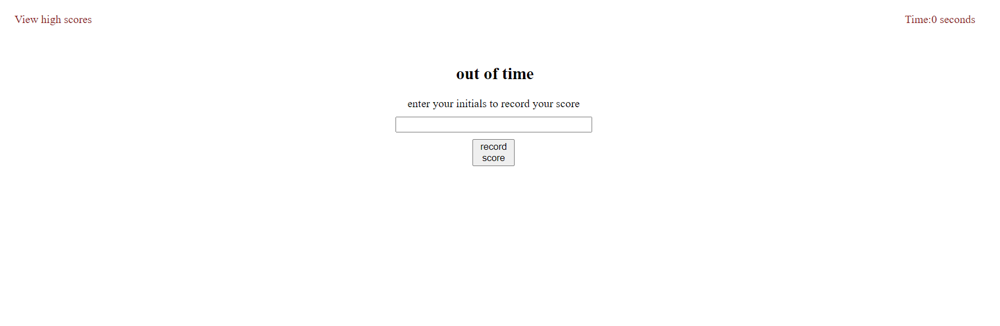
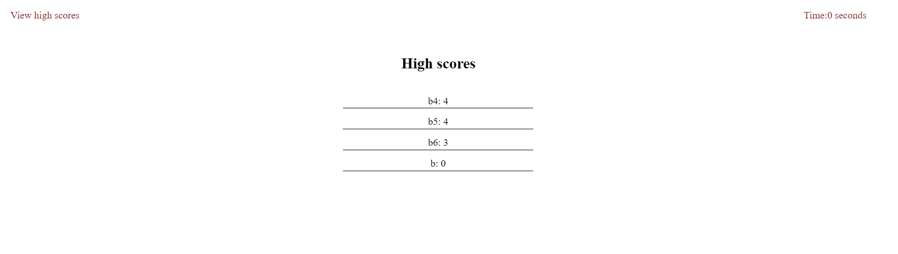

# coding-quiz

## Description

This application uses Javascript to display the questions of a multiple choice quiz and to record the user's score when he enter's a name or initials after the time runs out or all questions have been answered.

## Installation

N/A

## Usage

Clicking on the start button will display the first question and start the timer. Clicking on an answer choice will reveal whether it is correct and display the button which displays the next question when clicked. When there is no more time or all questions have been answered, the question being displayed will be replaced with a prompt for the user to enter a name or initials so that the score can be recorded. Refresh the page to return to the start

https://brendanshelton.github.io/coding-quiz/

## Credits

N/A

## License

MIT License

Copyright (c) 2022 BrendanShelton

Permission is hereby granted, free of charge, to any person obtaining a copy
of this software and associated documentation files (the "Software"), to deal
in the Software without restriction, including without limitation the rights
to use, copy, modify, merge, publish, distribute, sublicense, and/or sell
copies of the Software, and to permit persons to whom the Software is
furnished to do so, subject to the following conditions:

The above copyright notice and this permission notice shall be included in all
copies or substantial portions of the Software.

THE SOFTWARE IS PROVIDED "AS IS", WITHOUT WARRANTY OF ANY KIND, EXPRESS OR
IMPLIED, INCLUDING BUT NOT LIMITED TO THE WARRANTIES OF MERCHANTABILITY,
FITNESS FOR A PARTICULAR PURPOSE AND NONINFRINGEMENT. IN NO EVENT SHALL THE
AUTHORS OR COPYRIGHT HOLDERS BE LIABLE FOR ANY CLAIM, DAMAGES OR OTHER
LIABILITY, WHETHER IN AN ACTION OF CONTRACT, TORT OR OTHERWISE, ARISING FROM,
OUT OF OR IN CONNECTION WITH THE SOFTWARE OR THE USE OR OTHER DEALINGS IN THE
SOFTWARE.